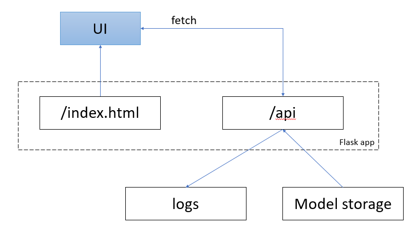

## Housing Price Prediction Model

### Описание проекта
Проект направлен на создание модели машинного обучения для прогнозирования цен на жилье. Модель использует различные характеристики объектов недвижимости для предсказания их рыночной стоимости.

### Структура проекта
```
housing_price_prediction/
├── data/
│   ├── raw/                # Исходные данные
│   ├── processed/          # Обработанные данные
├── models/                 # Обученные модели
├── notebooks/              # Jupyter notebooks
├── service/                # Сервис предсказания цены на недвижимость
│   ├── templates/          # Шаблоны для веб-приложения
│   └── app.py              # Flask приложение
├── src/                    # Исходный код
│   ├── data.py             # Обработка данных
│   ├── models.py           # Модели машинного обучения
│   └── utils.py            # Вспомогательные функции
├── requirements.txt        # Требования к зависимостям
└── README.md
```

### Архитектура сервиса ПА


### Как запустить
1. Клонируйте репозиторий:
```bash
git clone https://github.com/yourusername/housing_price_prediction.git
```

2. Установите зависимости:
```bash
pip install -r requirements.txt
```

3. Запустите Jupyter Notebook:
```bash
jupyter notebook

```

### Признаки
Используемые данные включают следующие характеристики:
* Площадь жилья
* Количество комнат
* Этаж
* Количество этажей в доме

### Модели машинного обучения
* **Linear Regression** - базовая линейная регрессия

### Метрики оценки
* **Mean Absolute Error (MSE)**
* **Root Mean Squared Error (RMSE)**
* **R² Score**

### Результаты
После обучения модели достигаются следующие результаты:
* MAE: 132958863083193.17
* RMSE: 11530778.95
* R² Score: 0.520505

### Как использовать модель
1. Загрузите данные в формате CSV
2. Обработайте данные с помощью предобработчиков
3. Загрузите обученную модель
4. Сделайте предсказания

### Команда
* **Data Scientist**: Федоров Александр
* **ML Engineer**: Федоров Александр
* **Product Manager**: Федоров Александр

### Лицензирование
Этот проект распространяется под лицензией MIT. Смотрите файл LICENSE для деталей.

### Контакты
Для вопросов и предложений обращайтесь:
* Email: your.email@example.com
* GitHub: @yourusername
* LinkedIn: linkedin.com/in/yourusername
